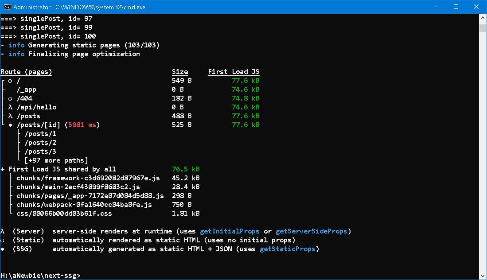
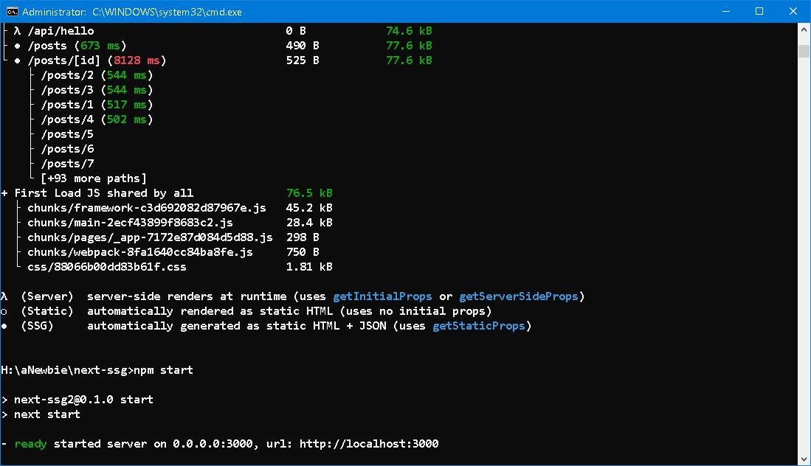
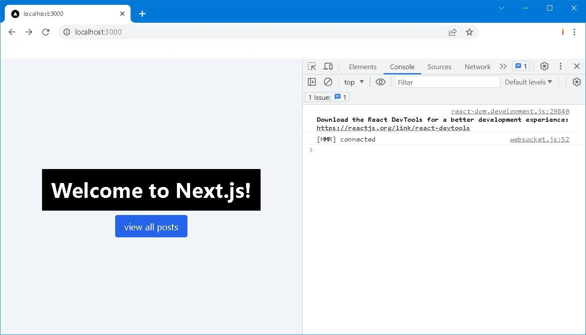
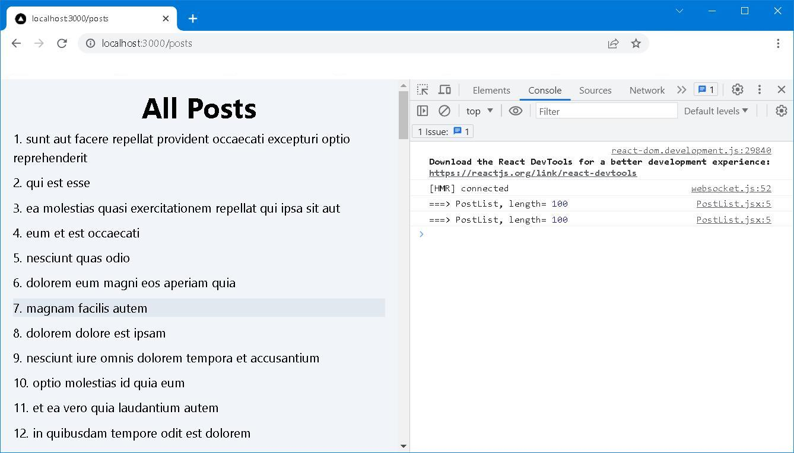
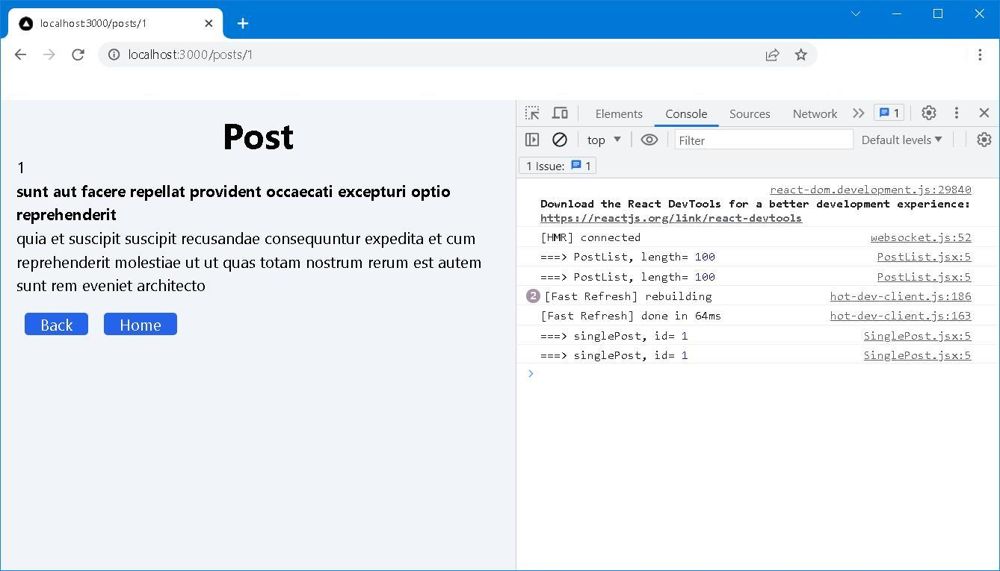

## SSG and ISR

<div style="text-align: right; color:white; background-color:black"><em>
“For God’s sake! — quick! — quick! — put me to sleep — or, quick! — waken me! — quick! — I say to you that I am dead!”
<br /><br />
The Facts in the Case of M. Valdemar<br />
Edgar Allan Poe
</em></div>


### Prologue
甘龍曰：「不然。聖人不易民而教，知者不變法而治。因民而教，不勞而成功；緣法而治者，吏習而民安之。」衛鞅曰：「龍之所言，世俗之言也。常人安於故俗，學者溺於所聞。以此兩者居官守法可也，非所與論於法之外也。三代不同禮而王，五伯不同法而霸。智者作法，愚者制焉；賢者更禮，不肖者拘焉。」

杜摯曰：「利不百，不變法；功不十，不易器。法古無過，循禮無邪。」衛鞅曰：「治世不一道，便國不法古。故湯武不循古而王，夏殷不易禮而亡。反古者不可非，而循禮者不足多。」

[《史記‧商君列傳》](https://ctext.org/shiji/shang-jun-lie-zhuan/zh)


### I. Terminology
- SSR - Server-Side Rendering
- CSR - Client-Side Rendering.
- SSG - Static Site Generation
- ISR - Incremental Static Regeneration

([Read more..](https://nextjs.org/docs/app/building-your-application/rendering))


### II. [TL;DR](https://www.merriam-webster.com/dictionary/TL%3BDR)
At the very moment when a URL is entered or a hyperlink is clicked on client browser, a HTTP request is fired, zigzagging, thronging and shouldering through it ways till the end point is reached. When HTTP server receives and resolves the resource; examines and executes code/scripts inside; merges and massages the resource with predefined boilerplates; generalizes and generates HTML; set for and send back to the client along with meta data (header, status etc) finally. 

As you can see, everything is done on the server and thus named *Server Side Rendering*. SSR is the traditional way of which the majority classic web applications behave. [PHP](https://www.php.net/) and [ASP.NET Web Forms](https://learn.microsoft.com/en-us/aspnet/web-forms/) are prominent milestones. Typically, code/scripts execution means pulling data from external databases. Server, per se, is the only workhorse and hence must be of great capacity in terms of RAM, CPU power as well as network bandwidth and always equipped with modules/plugins, software drivers and whatsoever pieces of things whenever it is necessary. 

Human evolves and so does web application. This time when a request reached the end point. Only a *barebone* HTML attendant with [Javascript](https://developer.mozilla.org/en-US/docs/Web/JavaScript) code are sent back to client browser. From then on, it takes control and subsequent HTTP requests are initiated to [API Gateway](https://microservices.io/patterns/apigateway.html) for any necessary resources. Again, Data are returned to client browser and be merged with the barebone and finallly HTML contents are displayed. 

**NOTE:**
Technically speaking, the process of filling barebone with stuffs to generate HTML page is known as [Hydration](https://en.wikipedia.org/wiki/Hydration_(web_development)). The data to be return from API Gateway is in [json](https://www.json.org/json-en.html) format. Code/scripts which invoke the API calls and pulls data from database but doesn't realize what type of database it's using.

As you can see, there are two servers, the first one serves static files which can be hosted on low-end HTTP server such as [nginx](https://nginx.org/en/). The second one is API Gateway which is responsible for database manipulation by means of [REST API](https://restfulapi.net/). Most of the works are done on client browser and thus named *Client Side Rendering*. CSR is the contemporary way of which majority modern web applications behave. Code/script can be written in pure javascript or more often than not using [jQuery](https://jquery.com/), front end frameworks such as [React](https://react.dev/), [Vue](https://vuejs.org/) or [Angular](https://angularjs.org/). 

So far so good... It's said that "利不百，不變法；功不十，不易器。法古無過，循禮無邪。" (Don't change the law if profit doesn't meet hundredfold; don't change the tool if yield doesn't reach ten times. There's nothing wrong with the old way)... But verythng has a cost. Cost, in terms of web applications, always means time and  money, ie. you can't achieve them both. You just can't get quick response time but low on hardware investment. 


### III. [SSG](https://nextjs.org/docs/pages/building-your-application/rendering/static-site-generation)
>In the realm of database, data are treated in different ways. Data, per se, can be divided into transactional and non-transactional. Code tables, such as employee names, product categories, site/location addresses, are typical non-transactional and be always referenced by transactional data. Since they are infrequently changed, caching code tables lest round-tripping to backend database again and again for the same set of data can be a performance boost especially for tight budget system.
([Read more...](https://github.com/Albert0i/yrunner-on-node/blob/main/README.V2.md))

SSG means all HTML pages are generated in build time and you can use it on many types of pages, including:

- Marketing pages
- Blog posts and portfolios
- E-commerce product listings
- Help and documentation

Some pages require fetching external data for pre-rendering. There are two scenarios, and one or both might apply. 

#### Scenario 1: Your page content depends on external data
Your posts page might need to fetch the list of posts from a API Gateway

pages/posts.jsx
```javascript
import React from 'react';
import PostList from '@/components/PostList';

function Posts({ posts }) {
  return <PostList posts={posts} />
}

export async function getStaticProps() {
  console.log('===> getStaticProps')

  const response = await fetch('https://jsonplaceholder.typicode.com/posts');
  const posts = await response.json();

  return {
    props: {
      posts,
    }
  };
}

export default Posts;
```
To fetch this data on pre-render, Next.js allows you to export an async function called `getStaticProps` from the same file. This function gets called at build time and lets you pass fetched data to the page's props on pre-render.


#### Scenario 2: Your page paths depend on external data
Next.js allows you to create posts with `dynamic routes`. For example, you can create a file called pages/posts/[id].jsx to show a single post based on id. This will allow you to show a post with id: 1 when you access posts/1.

pages/posts/[id].jsx
```javascript
import React from 'react';
import SinglePost from '@/components/SinglePost';

function PostPage({ post }) {
  return <SinglePost post={post} />
}

export async function getStaticPaths() {
  console.log('===> getStaticPaths')

  const response = await fetch('https://jsonplaceholder.typicode.com/posts');
  const posts = await response.json();

  const paths = posts.map((post) => ({
    params: { id: post.id.toString() },
  }));

  return {
    paths,
    fallback: false,
  };
}

export async function getStaticProps({ params }) {
  console.log('===> getStaticProps')

  const response = await fetch(
    `https://jsonplaceholder.typicode.com/posts/${params.id}`
  );
  const post = await response.json();

  return {
    props: {
      post,
    }
  };
}

export default PostPage;
```
So your page paths that are pre-rendered depend on external data. To handle this, Next.js lets you export an async function called `getStaticPaths` from a dynamic page (pages/posts/[id].jsx in this case). This function gets called at build time and lets you specify which paths you want to pre-render.











**CAVEAT:**
SSG is not a good idea if you cannot pre-render a page ahead of a user's request. Maybe your page shows frequently updated data, and the page content changes on every request.


### IV. [ISR](https://nextjs.org/docs/pages/building-your-application/data-fetching/incremental-static-regeneration)
>Next.js allows you to create or update static pages after you’ve built your site. Incremental Static Regeneration (ISR) enables you to use static-generation on a per-page basis, without needing to rebuild the entire site. With ISR, you can retain the benefits of static while scaling to millions of pages.

#### Scenario 1. Revalidation by time
To use ISR, add the revalidate prop to getStaticProps:

pages/posts.jsx
```
export async function getStaticProps() {
  console.log('===> getStaticProps')

  const response = await fetch('https://jsonplaceholder.typicode.com/posts');
  const posts = await response.json();

  return {
    props: {
      posts,
    },
    revalidate: 60 // Regenerate the page every 60 seconds
  };
}
```
When a request is made to a page that was pre-rendered at build time, it will initially show the cached page.

- Any requests to the page after the initial request and before 60 seconds are also cached and instantaneous.
- After the 60-second period, the next request will still show the cached (stale) page
- Next.js triggers a regeneration of the page in the background.
- Once the page generates successfully, Next.js will invalidate the cache and show the updated page. If the background regeneration fails, the old page would still be unaltered.


#### Scenario 2. On-Demand Revalidation 
>If you set a revalidate time of 60, all visitors will see the same generated version of your site for one minute. The only way to invalidate the cache is from someone visiting that page after the minute has passed.

>Starting with v12.2.0, Next.js supports On-Demand Incremental Static Regeneration to manually purge the Next.js cache for a specific page. This makes it easier to update your site.

pages/api/revalidate.js 
```
export default async function handler(req, res) {
    // Check for secret to confirm this is a valid request
    if (req.query.secret !== process.env.MY_SECRET_TOKEN) {
      return res.status(401).json({ message: 'Invalid token' })
    }
   
    try {
      // this should be the actual path not a rewritten path
      // e.g. for "/blog/[slug]" this should be "/blog/post-1"
      await res.revalidate('/posts')
      return res.json({ revalidated: true })
    } catch (err) {
      // If there was an error, Next.js will continue
      // to show the last successfully generated page
      return res.status(500).send('Error revalidating')
    }
  }
```

You can access the route (either manually or with a webhook) with the following URL structure:
```
http://localhost:3000/api/revalidate?secret=<token>
```
> If there is an error inside getStaticProps when handling background regeneration, or you manually throw an error, the last successfully generated page will continue to show. On the next subsequent request, Next.js will retry calling getStaticProps.


### V. Summary
There no a rule of thumb for everythng. In a similar way, there is no right or wrong, only a difference of types of applications. Obviously, SSG doesn't work with [OLTP](https://www.oracle.com/database/what-is-oltp/). A 10 pages or 10,000 pages website SHOULD be tackled differently... 

Throughout this example, [Pages Router](https://nextjs.org/docs/pages) is used instead of [App Router](https://nextjs.org/docs/app). 

> Before Next.js 13, the Pages Router was the main way to create routes in Next.js. It used an intuitive file-system router to map each file to a route. The Pages Router is still supported in newer versions of Next.js, but we recommend migrating to the new App Router to leverage React's latest features.

[Live demo](https://next-ssg.onrender.com/)


### VI. Reference
1. [What is CSR SSR SSG and ISR](https://youtu.be/YkxrbxoqHDw)
2. [Next.js 13: complete guide to Server Components and the App Directory](https://makerkit.dev/blog/tutorials/nextjs13)
3. [Next.js: The Ultimate Guide to SSR and SSG in React](https://medium.com/womenintechnology/next-js-the-ultimate-guide-to-ssr-and-ssg-in-react-245598d765c3)
4. [NextJS | getStaticProps](https://nextjs.org/docs/pages/building-your-application/data-fetching/get-static-props)
5. [NextJS | getStaticPaths](https://nextjs.org/docs/pages/building-your-application/data-fetching/get-static-paths)
6. [Incremental Static Regeneration (ISR) In Next.Js](https://blog.openreplay.com/incremental-static-regeneration-in-nextjs/)
7. [The Facts in the Case of M. Valdemar](https://poemuseum.org/the-facts-in-the-case-of-m-valdemar/)


### Epilogue 
```
```


### EOF (2023/07/25)
